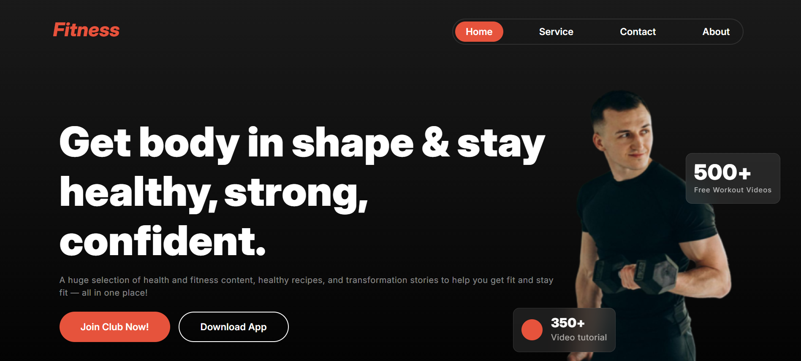
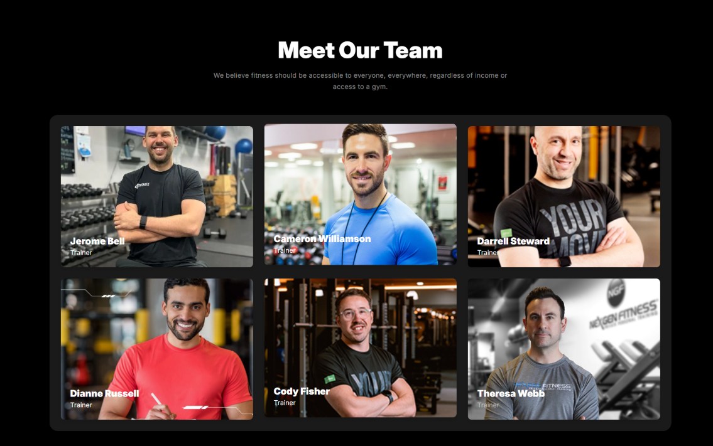

# 💪 Fit Forge - Fitness Related Landing Page

**Fit Forge** is a responsive fitness-related web landing page built with **HTML**, **Bootstrap**, and **custom CSS**.  
It showcases fitness services, promotes healthy habits, and provides a BMI calculator to engage users.

[🔗 Live Demo](https://devo-ab.github.io/fit-forge)

---

## ✨ Features

- 🧭 **Navigation Bar** – Easy navigation across sections  
- 🦾 **Hero Section** – Engaging fitness banner with call-to-action  
- 🔄 **Habits Section** – Promotes healthy fitness habits  
- 🏃 **Exercise Run Section** – Highlights workout and activity benefits  
- 🧮 **BMI Calculator** – Helps users calculate their Body Mass Index  
- 👥 **Team Section** – Displays fitness trainers and experts  
- 📑 **Footer** – Includes contact info & social links  
- 📱 **Responsive Design** – Optimized for all devices  

---

## 💻 Built With

- **HTML5**
- **Bootstrap 5**
- **Custom CSS**

---

## 📁 Folder Structure

```
fit-forge/
├── assets/
│   ├── images/             # Car and layout images
│   └── logo/               # Brand logos
├── css/                    # Custom CSS files
├── preview/                # Screenshots for README
├── index.html              # Main HTML file
└── README.md               # Project documentation

```

---

## 🖼️ Screenshots

###  Hero Section & Navbar



###  Team



### Full Page Preview


---

## 🚀 How to Use Locally

1. **Clone the repository**
   ```bash
   git clone https://github.com/devo-ab/fit-forge.git
   ```

# 👤 Author

# Avi Jit

## :mailbox: Reach me out

<p align="left">
<a href="https://linkedin.com/in/itsavijitb" target="blank"></a>
<a href="https://twitter.com/itsavijitb" target="blank"></a>
<a href="https://facebook.com/itsavijitb" target="blank"></a>
<a href="https://instagram.com/itsavijitb" target="blank"></a>
</p>
